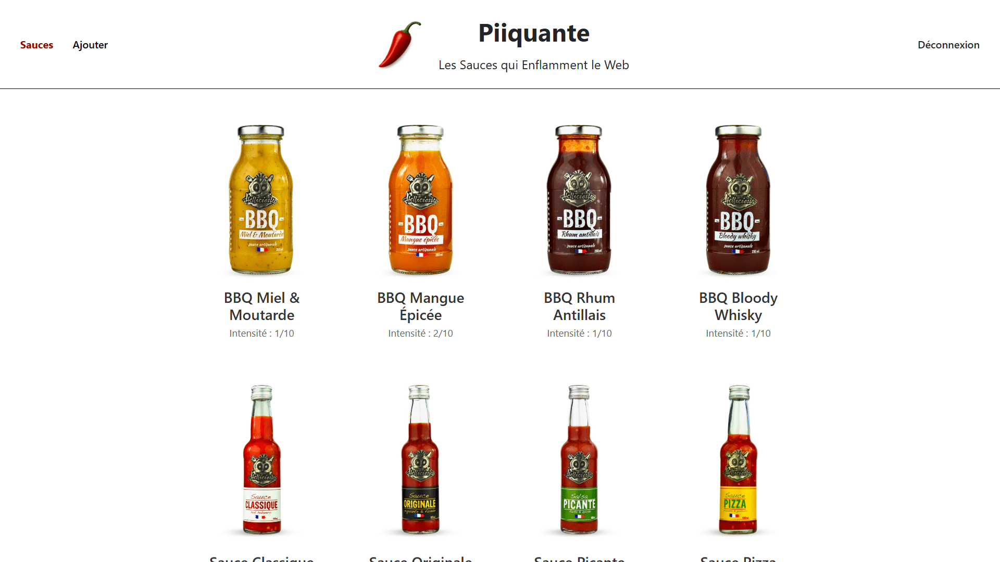

<div align="center">  
    <a href="https://piquante-sauces.vercel.app/signup" target="_blank">  
        
    </a>
    </br>  
    </br>  
  <h3 align="center">🌶 Piquante - Projet Scolaire</h3>  
</div>

## <br /> 📌 Sommaire

&nbsp;&nbsp;&nbsp; 🎨 &nbsp; [**Introduction**](#introduction)<br />
&nbsp;&nbsp;&nbsp; 🛠️ &nbsp; [**Technologies**](#technologies)<br />
&nbsp;&nbsp;&nbsp; 🎯 &nbsp; [**Fonctionnalités**](#fonctionnalités)<br />
&nbsp;&nbsp;&nbsp; 🚧 &nbsp; [**Mise à Jour**](#upgrade)<br />
&nbsp;&nbsp;&nbsp; 🚀 &nbsp; [**Installation**](#installation)

## <br /> <a name="introduction">🎨 Introduction</a>

Piquante est une application web fullstack dédiée au partage de sauces piquantes.

Basée sur un backend **Node.js** / **Express** connecté à **MongoDB**, et un frontend **Angular** moderne et responsive.

Les utilisateurs peuvent s’inscrire, publier des sauces, voter (like/dislike), et gérer leurs propres créations via une API REST sécurisée.

> 📂 Pour plus de détails, consultez le [dossier](.docs/).

## <br /> <a name="technologies">🛠️ Technologies</a>

- **Backend** : Node.js, Express, Mongoose, bcrypt, JSON Web Token (JWT)
- **Frontend** : Angular, RxJS
- **Base de données** : MongoDB Atlas ou MongoDB Compass local
- **Déploiement** : Render (API), Vercel (UI)
- **Image hosting** : Cloudinary

## <br /> <a name="fonctionnalités">🎯 Fonctionnalités</a>

- Authentification sécurisée (bcrypt + JWT)
- CRUD complet sur les sauces avec image
- Upload intelligent : local (dev) / Cloudinary (prod)
- Like / Dislike par utilisateur unique
- API REST sécurisée via JWT
- Interface Angular responsive
- Affichage des erreurs serveur côté client

## <br /> <a name="upgrade">🚧 Mise à Jour</a>

- Hébergement d’images via Cloudinary (CDN, compression, nettoyage automatique)
- Détection automatique de l’environnement : dev ou prod
- Gestion des erreurs enrichie côté client & serveur
- Upload intelligent : local en développement, Cloudinary en production
- Refactor : structure `api/` (backend) et `public/` (frontend)
- Déploiement performant via [**Render**](https://piquante-sauces-api.onrender.com) (API) & [**Vercel**](https://piquante-sauces.vercel.app) (UI)

## <br /> <a name="installation">🚀 Installation</a>

### ✅ Prérequis

- [Git](https://git-scm.com/) &nbsp;—&nbsp; Système de gestion de versions
- [Node.js](https://nodejs.org/fr) &nbsp;—&nbsp; Exécuteur local de scripts JavaScript
- [npm](https://www.npmjs.com/) &nbsp;—&nbsp; Gestionnaire de paquets JavaScript
- [MongoDB](https://www.mongodb.com/) &nbsp;—&nbsp; Base de données NoSQL
- [Google Chrome](https://www.google.com/) &nbsp;—&nbsp; Navigateur moderne
- [Visual Studio Code](https://code.visualstudio.com/) &nbsp;—&nbsp; Éditeur de code
- [Render](https://render.com/) &nbsp;—&nbsp; Déploiement de l’API en production
- [Cloudinary](https://cloudinary.com/) &nbsp;—&nbsp; Hébergement et optimisation des images
- [Vercel](https://vercel.com/home) &nbsp;—&nbsp; Déploiement du frontend en production

### 📥 Cloner le projet

```bash
git clone https://github.com/ValentinMadiot/piquante-sauces_api
cd piquante-sauces_api
```

### 📝 Configuration de l’environnement

#### 1. DEVELOPPEMENT (Local)

Renommer `.env.exemple` en `.env` dans `./api`

Ajoutez les variables d’environnement dans le fichier `.env` :

```bash
# IDENTIFIANT BASE DE DONNEES (MongoDB)
MONGODB_URI_DEV=mongodb://localhost:27017/piquante

# PASSWORD JWT (JSON Web Token)
JWT_TOKEN=secret_token

# ENVIRONNEMENT D'EXÉCUTION (dev = Stockage Local)
NODE_ENV=development
```

#### 2.1 PRODUCTION (Render)

Ajoutez les variables d’environnement sur Render :

```bash
# IDENTIFIANT BASE DE DONNEES (MongoDB)
MONGODB_URI_PROD=mongodb+srv://<username>:<password>@cluster0.mongodb.net/myDatabase...

# PASSWORD JWT (JSON Web Token)
JWT_TOKEN=secret_token

# ENVIRONNEMENT D'EXÉCUTION (prod = Cloudinary)
NODE_ENV=production

# IDENTIFIANT CLOUDINARY
CLOUD_API_KEY=clef_api
CLOUD_API_SECRET=api_secrete
CLOUD_NAME=nom_du_stockage
```

#### 2.2 FRONTEND (Vercel)

Ajoutez les variables d’environnement sur Vercel :

```bash
# URL RENDER
API_URL=https://nom_projet.onrender.com
```

### ▶️ Lancer le projet

#### Backend

```bash
cd api
npm install
npm start
```

Backend disponible sur : `http://localhost:8080`

#### Frontend

```bash
cd public
npm install
npm start
```

Frontend disponible sur : `http://localhost:4200`
